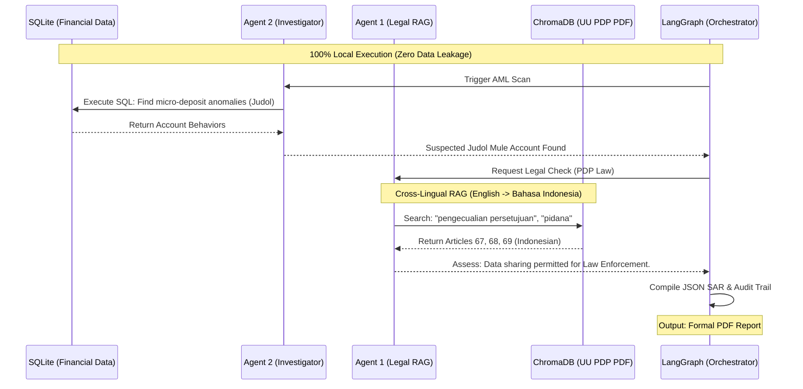

# 🕵️‍♂️ Autonomous RegTech Orchestrator: AML vs. PDP Law


An autonomous, multi-agent AI system designed to detect **Online Gambling (*Judi Online*) money laundering syndicates** while strictly adhering to Indonesia's Personal Data Protection Law (UU PDP No. 27 of 2022). 

This project runs **100% locally** (optimized for Edge AI / Intel Core Ultra processors) to guarantee zero data leakage of sensitive financial records.

## 📖 The Business Problem
Indonesian banks face a regulatory Catch-22:
1. **AML Compliance:** They must aggressively detect "Rekening Penampung" (mule accounts) laundering illicit funds.
2. **Data Privacy (PDP Law):** Sharing a suspect's KTP (Identity Card) and banking data with foreign cybercrime units without explicit consent risks a massive Rp 6 Billion fine.

**The Solution:** This Multi-Agent Orchestrator automates the investigation by blending deterministic SQL mathematics with Cross-Lingual RAG (Retrieval-Augmented Generation) to verify if the "Law Enforcement Exception" applies before generating a Suspicious Activity Report (SAR).

---

## System Architecture



---

##  Step-by-Step Installation

### 1. Install Prerequisites
You will need to install the following core tools on your machine:
* **Ollama**: To run the AI model locally. [Download here](https://ollama.com/download)
* **Pixi**: For fast, isolated Python package management. [Download here](https://pixi.sh/)

### 2. Download the Required Local LLM (Llama 3.1)
** THIS ONE IS VERY CRITICAL:** You must use **Llama 3.1** (or newer). Older versions (like base Llama 3) do not natively support the "Tool Calling" capabilities required by LangGraph. 

Open your terminal and run:
```bash
ollama run llama3.1
```
*(Wait for the ~4.7GB download to complete. Once you see the `>>>` prompt, you can close the terminal. Ollama will continue running in the background).*

### 3. Clone the Repository
```bash
git clone https://github.com/YOUR_USERNAME/autonomous-aml-orchestrator.git
cd autonomous-aml-orchestrator
```

### 4. Setup the Legal Document
Download the official Indonesian PDP Law document (UU No. 27 Tahun 2022). 
Rename the file exactly to `UU_PDP_27_2022.pdf` and place it directly in the root folder of this project.

### 5. Install Python Packages via Pixi
Create a `pixi.toml` file in your root folder (if you don't have one) and paste the following configuration:

```toml
[project]
name = "autonomous-aml-orchestrator"
channels = ["conda-forge"]
platforms = ["win-64", "linux-64", "osx-arm64", "linux-aarch64"]

[dependencies]
python = ">=3.10"
langchain = "*"
langchain-community = "*"
langchain-core = "*"
langchain-openai = "*"
langchain-huggingface = "*"
langgraph = "*"
chromadb = "*"
sqlalchemy = "*"
pydantic = "*"
pypdf = "*"
fpdf2 = "*"
```
Then, run this command to automatically install the environment:
```bash
pixi install
```

---

## Running the Orchestrator

Activate your Pixi shell and run the main Python script:

```bash
pixi shell
python orchestrator.py
```

### What happens when you run it?
1. **Data Generation:** It dynamically creates `aml_transactions.db`, injecting 900 normal transactions and 1 synthetic *Judi Online* mule account pattern.
2. **Vectorization:** It parses the Indonesian PDP Law PDF and stores it in ChromaDB using multilingual embeddings (`paraphrase-multilingual-MiniLM-L12-v2`).
3. **Execution Graph:**
   * **Agent 2 (Financial):** Writes SQL to flag the anomalous mule account.
   * **Agent 1 (Legal):** Searches the Indonesian PDF to extract strict legal limits regarding data sharing and identity theft penalties.
   * **Orchestrator:** Parses the JSON output deterministically using Defensive Parsing.
4. **PDF Generation:** Outputs a formal, CCO-ready document named `SAR_ACC_777_JUDOL_MULE.pdf`.

---

##  Expected Output
Upon successful execution, the terminal will display a strict, timestamped Audit Trail (critical for banking compliance) and a human-readable JSON summary.

Check your project folder for the final output: **`SAR_ACC_777_JUDOL_MULE.pdf`**.

---

## Disclaimer
This project uses synthetic financial data and generative AI for educational and portfolio demonstration purposes. It does not constitute actual legal advice regarding Indonesian Law. Always consult a certified legal professional for real-world PDP compliance.